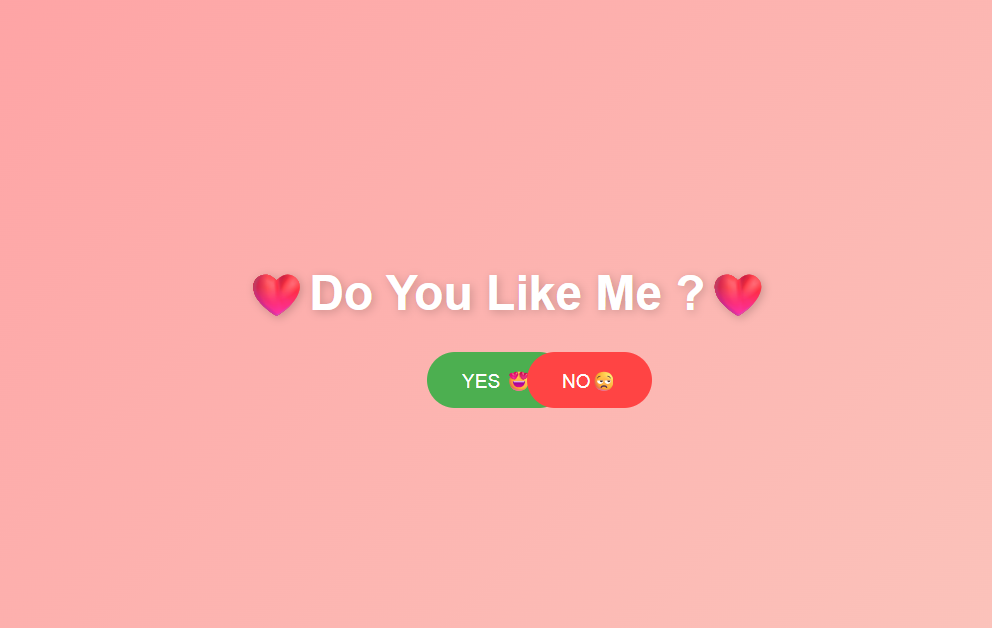

# ❤️ Do You Like Me?

A fun and interactive prank website built with **HTML, CSS, and JavaScript** where the user is asked a simple question:

> **"Do You Like Me?" ❤️**

The catch? The **NO** button refuses to cooperate and keeps running away, making it nearly impossible to click. Meanwhile, the **YES** button becomes more tempting with every failed attempt.

Once the user clicks **YES**, the website celebrates with confetti, floating hearts, sound effects, and a victory popup.

---

## 🎮 Features

* ❤️ Interactive "Do You Like Me?" question
* 🏃 Escaping NO button
* 📈 YES button grows larger after every NO attempt
* 😂 Random funny messages and reactions
* 🎉 Confetti celebration animation
* 💕 Floating heart effects
* 🔊 Built-in sound effects using JavaScript Audio API
* 📱 Mobile-friendly support
* 🎨 Animated gradient background
* 🥳 Victory popup with GIF animation

---

## 📸 Preview

Add a screenshot of your project here.





---

## 🛠️ Technologies Used

* HTML5
* CSS3
* JavaScript (Vanilla JS)
* Web Audio API

---

## 🚀 Getting Started

### 1. Clone the Repository

```bash
git clone https://github.com/code-with-ushant/Undinablequestion.git
```

### 2. Open the Project

Simply open the `index.html` file in your browser.

No installation or dependencies required.

---

## 📂 Project Structure

```text
do-you-love-me/
│
├── index.html
├── screenshot.png
└── README.md
```

---

## 🎯 How It Works

1. User is asked if they love you.
2. Clicking or hovering over the NO button causes it to move away.
3. Every failed attempt increases the size of the YES button.
4. Funny messages appear to encourage the user.
5. After enough attempts, the NO button gives up.
6. Clicking YES triggers:

   * Confetti explosion 🎉
   * Floating hearts ❤️
   * Victory sound 🔊
   * Celebration popup 🥳

---

## 💡 Future Improvements

* Multiple celebration themes
* Background music toggle
* Custom messages
* Dark mode
* Different difficulty levels
* Share result button
* Love meter animation

---

## 👨‍💻 Author

**Ushant**

Created for fun, entertainment, and learning front-end web development.

---

## 📜 License

Copyright © 2026 Ushant.

All Rights Reserved.

This project is provided for educational and entertainment purposes. Unauthorized redistribution or commercial use without permission is prohibited.
